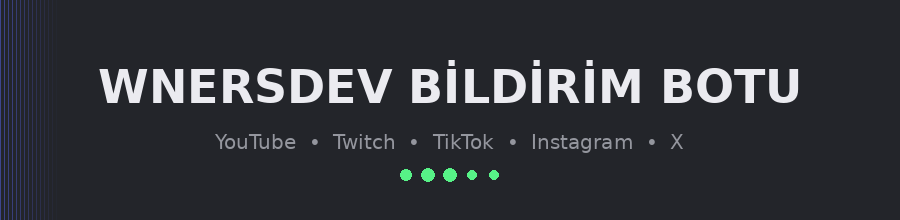
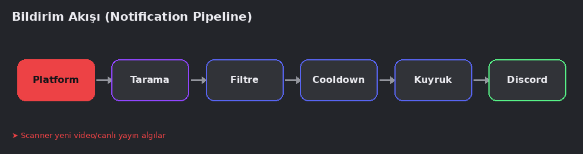
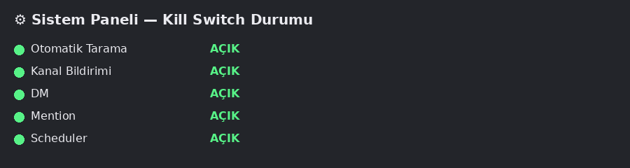

<div align="center">



### Discord için gelişmiş, çoklu platform destekli **Bildirim + Duyuru + DM + Otomatik İzleme + Yönetim** sistemi


</div>

---

## Selam kanka 👋

Bu, sıfırdan yazılmış, **mock/fake veri barındırmayan**, gerçek YouTube ve Twitch API entegrasyonlu, production'a hazır bir Discord bildirim botu. Aşağıda ne yaptığını, nasıl kurulacağını ve nasıl çalıştığını görsellerle anlattım — kahveni al, 5 dakikanı ayır. ☕

## İçindekiler

- [Bu bot ne yapar?](#bu-bot-ne-yapar)
- [Bildirim akışı nasıl işliyor?](#bildirim-akışı-nasıl-işliyor)
- [Kurulum](#kurulum)
- [ayarlar.json alanları](#ayarlarjson-alanları)
- [Komutlar](#komutlar)
- [Sistem paneli & kill-switch](#sistem-paneli--kill-switch)
- [Proje mimarisi](#proje-mimarisi)
- [Platform kurulum notları](#platform-kurulum-notları)
- [Yerel test notu (dürüst kısım)](#yerel-test-notu-dürüst-kısım)
- [Production'da çalıştırma](#productionda-çalıştırma)
- [SSS](#sss)

---

## Bu bot ne yapar?

| Özellik | Durum |
|---|---|
| 📹 YouTube (yeni video, Shorts, canlı yayın) | ✅ Gerçek API entegrasyonu |
| 🎮 Twitch (canlı yayın algılama) | ✅ Gerçek API entegrasyonu (OAuth dahil) |
| 🎵 TikTok / 📷 Instagram / ✖️ X | ⚫ Dürüstçe `UNCONFIGURED` (resmi API yok, sahte veri de yok) |
| 📢 Anlık / planlı / acil duyuru | ✅ |
| 👤 Kullanıcı bazlı abonelik + DM | ✅ |
| 🎛️ Components V2 kurulum sihirbazı | ✅ |
| 🛑 Kill-switch, bakım modu | ✅ |
| 🔁 Queue, retry/backoff, rate limit, cache | ✅ |
| 🧾 Audit log, bildirim geçmişi, istatistik | ✅ |
| 🏢 Multi-guild izolasyonu | ✅ |

> **Neden bazı platformlar kapalı?** TikTok/Instagram/X için genel kullanıma açık, kimlik doğrulaması basit bir tarama API'si yok. "Çalışıyormuş gibi" göstermek yerine botun kendisi `/tiktok durum` gibi komutlarla bunu açıkça söylüyor. Sahte veri üretmek bu projede yasak. 🚫

---

## Bildirim akışı nasıl işliyor?

Her bildirim, gönderilmeden önce bu 6 aşamadan geçiyor:



1. **Platform** — Scanner, YouTube/Twitch API'sinden en son içeriği çeker
2. **Tarama** — Yeni mi eski mi, daha önce gönderildi mi kontrol edilir (duplicate koruması)
3. **Filtre** — Sunucu/kaynak bazlı anahtar kelime engelleme/izin listesi uygulanır
4. **Cooldown** — Spam olmaması için bekleme süresi kontrol edilir
5. **Kuyruk** — CRITICAL/HIGH/NORMAL/LOW önceliğine göre sıraya girer
6. **Discord** — Kanal, DM ve/veya rol mention ile profesyonel bir embed olarak iletilir

Bu akışın her adımı `src/services/notificationService.js` içinde tek bir yerde yönetiliyor, dağınık değil.

---

## Kurulum

```bash
# 1) Bağımlılıkları yükle
npm install

# 2) Config dosyasını oluştur
cp ayarlar.example.json ayarlar.json

# 3) ayarlar.json içini kendi bilgilerinle doldur (token, clientId, mongoUri, apiKey...)

# 4) Slash komutları Discord'a kaydet
npm run deploy-commands

# 5) Botu başlat
npm start
```

> Eksik bıraktığın alanlar botu **çökertmez**. İlgili özellik otomatik olarak `UNCONFIGURED` durumuna düşer, bot çalışmaya devam eder. `/sistem durum` ile her şeyin gerçek durumunu görebilirsin.

---

## ayarlar.json alanları

| Alan | Açıklama | Zorunlu mu? |
|---|---|---|
| `token` | Discord bot token'ı | ✅ Bot açılmadan zorunlu |
| `clientId` | Discord application client ID | ✅ Slash komut kaydı için zorunlu |
| `mongoUri` | MongoDB bağlantı adresi | ⚠️ Yoksa DB özellikleri UNCONFIGURED |
| `ownerIds` | OWNER yetkisindeki kullanıcı ID'leri | ⚠️ Kill-switch/config-yenile için gerekir |
| `notifications.platforms.youtube.apiKey` | YouTube Data API v3 anahtarı | ⚠️ Yoksa YouTube UNCONFIGURED |
| `notifications.platforms.twitch.clientId/clientSecret` | Twitch uygulama bilgileri | ⚠️ Yoksa Twitch UNCONFIGURED |

---

## Komutlar

<details>
<summary><b>📬 /bildirim</b> — ana bildirim yönetimi</summary>

`kur` · `ac` · `kapat` · `kanal` · `dm` · `rol` · `test` · `tara` · `liste` · `gecmis` · `istatistik`
</details>

<details>
<summary><b>📹 /youtube</b> — YouTube kaynak yönetimi</summary>

`ekle` · `sil` · `liste` · `duzenle` · `tara` · `test` · `durum` · `kanal`
</details>

<details>
<summary><b>🎮 /twitch</b> — Twitch kaynak yönetimi</summary>

`ekle` · `sil` · `liste` · `duzenle` · `tara` · `test` · `durum`
</details>

<details>
<summary><b>🎵 /tiktok · 📷 /instagram · ✖️ /x</b> — durum sorgulama</summary>

`durum` — resmi API yapılandırılmadığı için dürüst bir şekilde `UNCONFIGURED` döner.
</details>

<details>
<summary><b>👤 Abonelik</b></summary>

`/aboneliklerim` · `/abone ol` · `/abonelik iptal` · `/abonelik liste`
</details>

<details>
<summary><b>📢 /duyuru</b></summary>

`gonder` · `planla` · `liste` · `iptal` · `test` · `acil` (sadece OWNER)
</details>

<details>
<summary><b>⚙️ /sistem</b> (OWNER)</summary>

`durum` · `istatistik` · `config-yenile` · `bakim` · `kill-switch`
</details>

---

## Sistem paneli & kill-switch

`/sistem durum` komutu Components V2 ile canlı bir panel açar; `/sistem kill-switch` ile alt sistemleri tek tek kapatabilirsin:



Kapatılabilen alt sistemler: **otomatik tarama, kanal bildirimi, DM, mention, scheduler.** Kritik bir sorun olduğunda tüm botu durdurmana gerek yok — sadece sorunlu parçayı kapat.

---

## Proje mimarisi

```
wnersdev.js              → bootstrap (sadece başlatma, iş mantığı YOK)
ayarlar.json              → tüm yapılandırma

src/
  commands/               → slash komut giriş noktaları (ince katman)
  services/               → iş mantığı (bildirim motoru, platform entegrasyonları...)
  database/
    models/                 → 9 Mongoose modeli
    repositories/           → veri erişim katmanı (DB yoksa güvenli fallback)
  jobs/                   → periyodik tarama + zamanlanmış duyurular
  core/                   → config, logger, queue, cache, rate limit, retry, state
  components/             → Components V2 panelleri, butonlar, seçim menüleri, modallar
  events/                 → ready, interactionCreate, guildCreate, guildDelete
  utils/                  → validators, formatters, time, ids, security
```

`src/commands/` yalnızca komut giriş noktasıdır; gerçek iş `services/`, `core/` ve `database/` içindedir — spec'in 88. maddesindeki kod kalitesi kuralına birebir uyar.

---

## Platform kurulum notları

**YouTube** → Google Cloud Console'da proje aç, **YouTube Data API v3**'ü etkinleştir, API anahtarını `ayarlar.json` → `platforms.youtube.apiKey` alanına yaz. Günlük kota sınırlı, `scanIntervalSeconds` değerini buna göre ayarla.

**Twitch** → [dev.twitch.tv/console](https://dev.twitch.tv/console) üzerinden uygulama oluştur, Client ID/Secret'ı `ayarlar.json`'a yaz. Bot, app access token'ı otomatik alır ve yeniler.

**TikTok / Instagram / X** → Genel kullanıma açık resmi bir tarama API'si olmadığından entegre edilmedi. `src/services/tiktokService.js` (ve diğerleri) resmi erişimin olduğu gün dolduracağın hazır bir iskelet.

---

## Yerel test notu (dürüst kısım)

Bu proje **internet erişimi olmayan bir sandbox'ta** geliştirildi, o yüzden abartmadan gerçeği söylüyorum:

✅ Yapıldı:
- Tüm `.js` dosyalarının sözdizimi (syntax) kontrolü — hata yok
- Tüm modüllerin require/export uyumu statik olarak doğrulandı
- Bootstrap akışı (config → DB bağlantı denemesi → komut yükleme → queue → scanner → health → graceful shutdown) uçtan uca simüle edildi, hatasız tamamlandı

❌ Yapılamadı (senin ortamında ilk çalıştırmada gerçekleşecek):
- Gerçek Discord sunucusuna bağlanma
- Gerçek MongoDB okuma/yazma
- Gerçek YouTube/Twitch API çağrıları

Credential'ları girdikten sonra `/sistem durum` ve `/bildirim test` ile gerçek ortamda doğrula.

---

## Production'da çalıştırma

```bash
npm install -g pm2
pm2 start wnersdev.js --name wnersdev-bot
pm2 save
```

---

## SSS

**S: TikTok/Instagram/X ne zaman gelecek?**
C: Resmi, genel kullanıma açık bir API bulduğunda ya da erişim satın aldığında — iskelet hazır, sadece `resolveSource`/`fetchLatest` fonksiyonlarını doldurman yeterli.

**S: MongoDB'siz çalışır mı?**
C: Evet, bot çökmez. Ama kaynak ekleme, abonelik, duyuru geçmişi gibi kalıcı özellikler `UNCONFIGURED` kalır.

**S: @everyone mention'ı kim kullanabilir?**
C: Sadece `ownerIds` listesindeki OWNER kullanıcılar.

---

<div align="center">

Sorun/öneri mi var? Kodun her katmanı ayrık ve test edilebilir şekilde yazıldı — üzerine güvenle inşa edebilirsin. 🚀

</div>
